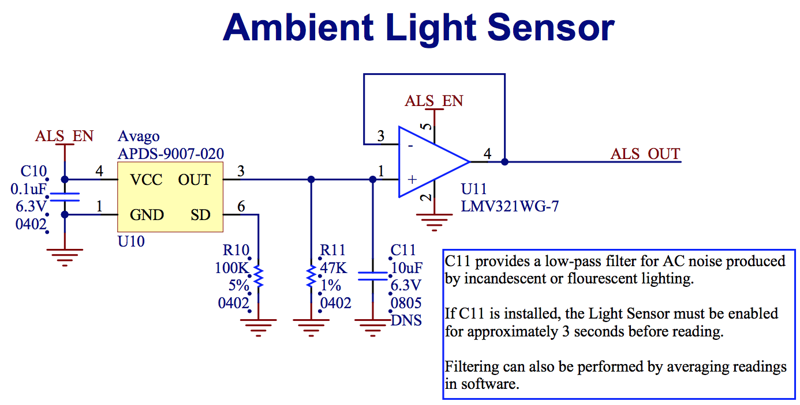

Driver for the APDS9007 Analog Ambient Light Sensor
===================================

The [APDS9007](http://www.mouser.com/ds/2/38/V02-0512EN-4985.pdf) is a simple, low-cost ambient light sensor from Avago. This sensor outputs a current that is log-proportional to the absolute brightness in Lux. A load resistor is connected to the output of the sensor and used to generate a voltage which can be read to determine the brightness.

Because imps draw a small input current on analog input pins, and because the output current of this part is very low, a buffer is recommended between the load resistor and the imp for best accuracy.

**To add this library to your project, add** `#require "APDS9007.class.nut:3.0.0"` **to the top of your device code**

[](https://travis-ci.org/electricimp/APDS9007)

## Hardware

The APDS9007 should be connected as follows:



## Class Usage

### Constructor

To instantiate a new APDS9007 object, you need to pass in the configured analog input pin to which the sensor is connected, the value of your chosen load resistor and, optionally, a configured digital output sensor-enable pin.

```squirrel
const RLOAD = 47000.0

analogInputPin <- hardware.pin5
analogInputPin.configure(ANALOG_IN)

enablePin <- hardware.pin7
enablePin.configure(DIGITAL_OUT, 0)

lightsensor <- APDS9007(analogInputPin, RLOAD, enablePin)
```

### Class Methods

### enable(*[state]*)

This method enables the APDS9007. It may be passed either `true` or `false`; by default, *state* is set to `true`. Passing `false` will disable the APDS9007.

If an enable pin has been configured, the APDS9007 **must** be enabled before attempting to read the light level. To get an accurate reading, the sensor must be enabled for at least five seconds before taking a reading.


```squirrel
lightsensor.enable(true);
```

### getPointsPerReading()

This method returns the number of readings (data points) taken and internally averaged to produce a light level result. By default, the number of data points per reading is set to ten.

```squirrel
server.log(lightsensor.getPointsPerReading());
```

### setPointsPerReading(pointsPerReading)

This method sets the number of readings (data points) taken and internally averaged to produce a light level result. The points per reading value is returned. By default, the number of data points per reading is set to ten.

```squirrel
// Set number of readings to be averaged to 15.
// Slower than default, but more precise.
lightsensor.setPointsPerReading(15);
```

### read(*[callback]*)

The *read()* method returns the ambient light level in [Lux](http://en.wikipedia.org/wiki/Lux). The sensor **must** be enabled for at least five seconds before a reading is returned, unless no enable pin is specified, in which case the reading is returned immediately.

If a callback is supplied, the *read()* method will execute asynchronously and a result table will be passed to the callback function. If no callback is supplied, the *read()* method will execute synchronously and a result table will be returned.

If the reading was successful the result table will contain the key *brightness* with the reading result, otherwise the result table will contain the key *err* with the error message.

**Asynchronous Example:**

```squirrel
lightsensor.read(function(result) {
    if ("err" in result) {
        server.error("Error Reading APDS9007: " + result.err);
    } else {
        server.log("Light level = " + result.brightness + " Lux");
    }
});
```

**Synchronous Example**

```squirrel
local result = lightsensor.read();
if ("err" in result) {
    server.error("Error Reading APDS9007: " + result.err);
} else {
    server.log("Light level = " + result.brightness + " Lux");
}
```

## Example

```squirrel
// Value of load resistor on ALS
const RLOAD = 47000.0;

// Use pin 5 as analog input
analogInputPin <- hardware.pin5;
analogInputPin.configure(ANALOG_IN);

// Use pin 7 as enable pin
enablePin <- hardware.pin7;
enablePin.configure(DIGITAL_OUT, 0);

// Initialize driver class
lightsensor <- APDS9007(analogInputPin, RLOAD , enablePin);

// Enable sensor
lightsensor.enable(true);

// Get reading
function readLightLevel() {
    lightsensor.read(function (result) {
        if ("err" in result) {
            server.error("Error Reading APDS9007: " + result.err);
            return;
        }
        
        server.log("Light level = " + result.brightness + " Lux");
        
        // Repeat in 2 seconds
        imp.wakeup(2.0, readLightLevel); 
    });
};

// Start reading light level every 2 seconds,
// the first reading will arrive in 5 secs
readLightLevel();
```

## Testing

Repository contains [impUnit](https://github.com/electricimp/impUnit) tests and a configuration for [impTest](https://github.com/electricimp/impTest) tool.

Tests can be launched with:

```bash
imptest test
```

By default configuration for the testing is read from [.imptest](https://github.com/electricimp/impTest/blob/develop/docs/imptest-spec.md).

To run test with your settings (for example while you are developing), create your copy of **.imptest** file and name it something like **.imptest.local**, then run tests with:

 ```bash
 imptest test -c .imptest.local
 ```

## License

The APDS9007 library is licensed under the [MIT License](./LICENSE).
